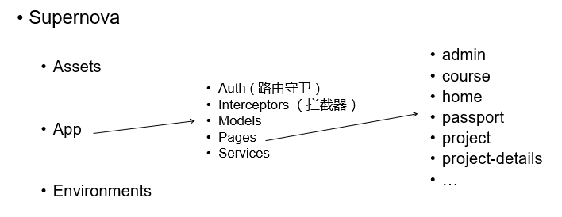

# Supernova PBL System - 超新星项目式学习系统

A course project for Advanced Web Technologies at FDU, Spring 2020. 

> 高级Web技术课程Project - PBL选题

### Group #3  // TODO:补一下学号

17302010002 黄元敏 组长

17302010025 李翀

王麒迪

张思源

## 1 项目设计

### 1.1 项目结构组织及文件说明

#### 1.1.1 前端项目

本项目前端使用了[Angular](https://angular.io/start) 9.1框架，集成使用了[NG ZORRO](https://ng.ant.design/docs/introduce/en) 9.1前端组件库进行组件化开发，甘特图组件使用了GitHub上的项目[Gantt Gantt Gantt Schedule Timeline Calendar](https://github.com/neuronetio/gantt-schedule-timeline-calendar)。

下图所展示的是前端项目`src/`下的文件结构，主要包括：

1. `assets`：项目静态文件夹，如项目logo；

2. `app`：项目主要代码文件夹，其中包括：

   a. `auth`：用于存放项目路由守卫；

   b. `interceptors`：用于存放项目拦截器；

   c. `models`：用于存放前后端交互的传输对象结构；

   d. `pages`：用于存放按页面分类的源代码；

   ​	单个页面为一个文件夹，构成一个Route Module，内部包括组件代码（内部`components/`下）和页面代码；

   e. `services`：用于存放按传输对象分类的服务类，封装了向后端请求数据的方法；

3. `environments`：项目环境变量文件夹，如正向代理的URL配置；

图1 前端项目结构示意图

#### 1.1.2 后端项目

本项目后端使用了助教提供的Spring boot与MyBatis快速搭建[框架](https://github.com/lihengming/spring-boot-api-project-seed)，使用的[Spring boot](https://www.jianshu.com/p/1a9fd8936bd8) 版本为1.5.13，[MyBatis](https://mybatis.org/mybatis-3/zh/index.html)的版本为1.3.1。在开发身份认证功能的过程中使用到了Spring boot AOP插件，并在Maven配置文件中引入了该插件。

下图所展示的是前端项目`src/main`下的文件结构，主要包括：

1. `java/com.SuperNova`

   a. `configurer`：项目部分参数

   b. `core`：项目所需工具类与部分高级抽象接口

   c. `dao`：MyBatis接口

   d. `model`：POJO模型类代码

   e. `service`：service接口与实现类

   f.  `web`：接口控制器与截面类

2. `docker`

   dockerfile

3. `resources`

   a. `mapper`：MyBatis所需映射xml文件

   b. `Setting`：项目相关配置信息

图2 后端项目结构示意图

### 1.2 关键功能实现细节

TODO：请大嘎找一些自己实现项目中的难点或者重要的点在这里写一下，格式就是1.2.x 某某某，注意应该是四级标题了

我可能会写甘特图和层级路由+路由守卫这样

项目评分的设计需要谁比较了解的写一下

### 1.3 服务器部署配置的详细介绍

本项目我们使用了张思源提供的阿里云服务器，配置如下：

> 系统版本：CentOS Linux 7.8.2003 (Core)
>
> CPU：单核
>
> 内存：2G
>
> 存储：40G

由于项目源代码使用GitHub进行管理，因此可以便捷地在服务器上clone一份项目仓库，并不断地根据项目最新情况进行代码的更新和构建，避免了在本地和云端之间反复缓慢的文件传输过程。

前后端的项目部署我们均采用了Docker的方式，具体部署步骤将在接下来的两部分中详细阐述。

#### 1.3.1 前端项目

如前所述，首先在服务器上clone了项目代码仓库，在每次部署前均需要进行`git pull`操作以实现代码同步。

在首次克隆代码仓库之后，需要执行`npm install`指令安装编译需要的依赖（在项目依赖发生变化之后也需要执行这一步）。

而后执行`ng build --prod`指令对项目进行部署环境的编译，该指令会用到项目中的`environments/environment.prod.ts`文件，而后在前端项目根目录下生成一个`dist/`目录，其中包含项目编译完成后的结果。

TODO：未完成

#### 1.3.2 后端项目

TODO：请李翀写一下~

## 2 团队分工

本次项目在设计阶段是四位同学共同讨论设计的，完成的内容包括项目的按页面功能、UI设计，数据库设计（见第4节）。而后在项目动工之初，是前后端各自独立开发的，由黄元敏和王麒迪负责前端，李翀和张思源负责后端。在项目中后期，由于前后端工作量存在一定差距，后端的同学也逐渐加入到前端的开发中；同时，前端同学在接口对接的过程中也参与部分后端接口实现的修改。

四位成员最终工作量比较平均，合作也比较紧密，经组内商议均同意对项目得分进行平分，供助教参考。

以下则列出每位成员具体负责完成的工作。

### 17302010002 黄元敏，主要负责项目前端，GitHub账号：HNoodles

主要工作包括：

1. 前端项目结构整体设计；
2. 层级路由及路由守卫的设计与实现；
3. 甘特图组件的应用实现；
4. 前端项目的部署。

负责开发的页面有：

1. 登录页面（布局 + 功能）；
2. 课程列表页面（布局 + 大部分功能）；
3. 项目列表页面（布局 + 大部分功能）；
4. 任务列表子页（甘特图，布局 + 功能）；
5. 文件管理子页（布局）；
6. 任务管理子页（布局 + 功能）。

### 李翀

主要工作包括：

1. 后端项目结构整体设计；

   	2. 项目前后端接口设计；
   	3. 后端接口实现；
   	4. 身份验证实现；
   	5. 后端项目部署；
   	6. 图片与文件服务器部署

负责开发的界面有：

1. 文件上传、下载与删除界面(功能)
2. 课程管理界面(布局+功能)

### 王麒迪

TODO：每个人负责的工作请如上格式列举一下~

### 张思源

TODO：每个人负责的工作请如上格式列举一下~

## 3 项目使用指南

详见`docs`文件夹下的”Supernova PBL System 使用说明“，源文件为Usage.md，其中包括了项目部署地址、登录注册方式，以及各类用户可用功能列举。

## 4 其它

### 4.1 项目分页面设计文档

详见`docs`文件夹下的“按页面分类的功能、UI设计”，源文件为Design by Pages.md，其中包括项目各个主要页面的功能、样式设计原型。其内容与最终实现的结果基本符合，可供参考。

### 4.2 数据库设计文档

详见`docs`文件夹下的“数据库设计”，源文件为Database Design.md，其中包括项目后端数据库表的详细设计以及说明，可供参考。

### 4.3 项目前后端接口文档

详见`docs`文件夹下的“按页面分类的接口设计（请求URL、输入、输出）”，源文件为API Design.md，其中包括项目前后端分页面归类的的接口设计。该文档内容主要由李翀完成，在后续开发过程中，其余三位同学对该文档均有所删改，少部分新增接口可能没有写入改文件中。从该文件可以看出项目整体API设计风格，以及大部分API设计实现，可供参考。

### 4.4 项目合作开发共享文档

详见石墨文档[PBL PJ剩余工作checklist](https://shimo.im/docs/96dGHRY36qKqxJJk)，其中包括项目中后期分页面待完善功能列表、发现的Bug列表、API修改建议、部署笔记等内容，为小组协作开发过程的记录，可供参考。

### 4.5 项目GitHub地址

https://github.com/HNoodles/pbl-learning-platform

本项目目前为`Private`项目，在项目截至日期过后将考虑设置为`Public`，可供参考。